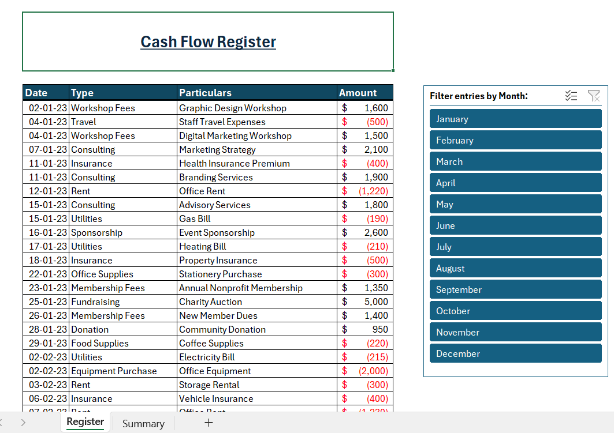
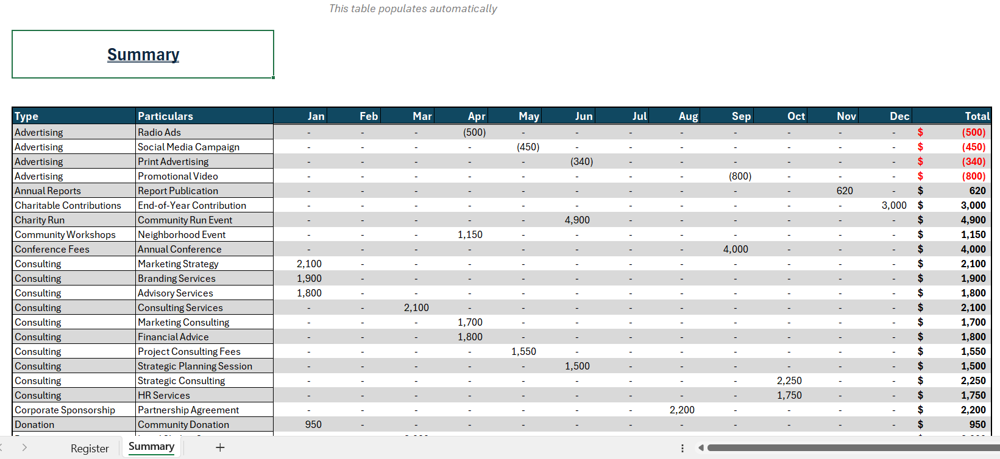

# <u> Automated Monthly Cash Flow Manager </u>

## Overview

This Excel based system automates the tracking of transactions, categorizes them by type and particulars, and generates a summary table for each month. Download it [here](https://github.com/AsherGeorgy/My-Portfolio/raw/refs/heads/main/Microsoft%20Excel/assets/Cash%20Flow%20Manager.xlsx)

## How It Works

- Users enter the date, type, particulars, and amount in the 'Register' sheet.
- The 'Summary' sheet automatically updates with categorized transactions for each month.

## Formulas Used

#### Populate the transaction type and particulars:  
    = SORT(UNIQUE(FILTER('Register'!$D:$E, ('Register'!$D:$D<>""  ) + ('Register'!$E:$E<>""))))

#### Obtain corresponding summary:  
    = SUMIFS('Register'!$F:$F,'Register'!$D:$D,Summary!$B5,'Register'!$E:$E,Summary!$C5,'Register'!$G:$G,Summary!D$2)

## Conclusion
This cash register system has streamlined transaction tracking, providing an efficient and user-friendly solution.

--- 
 

#### Screenshots:
**Cash Flow Register**

---
**Monthly Summary**

---

