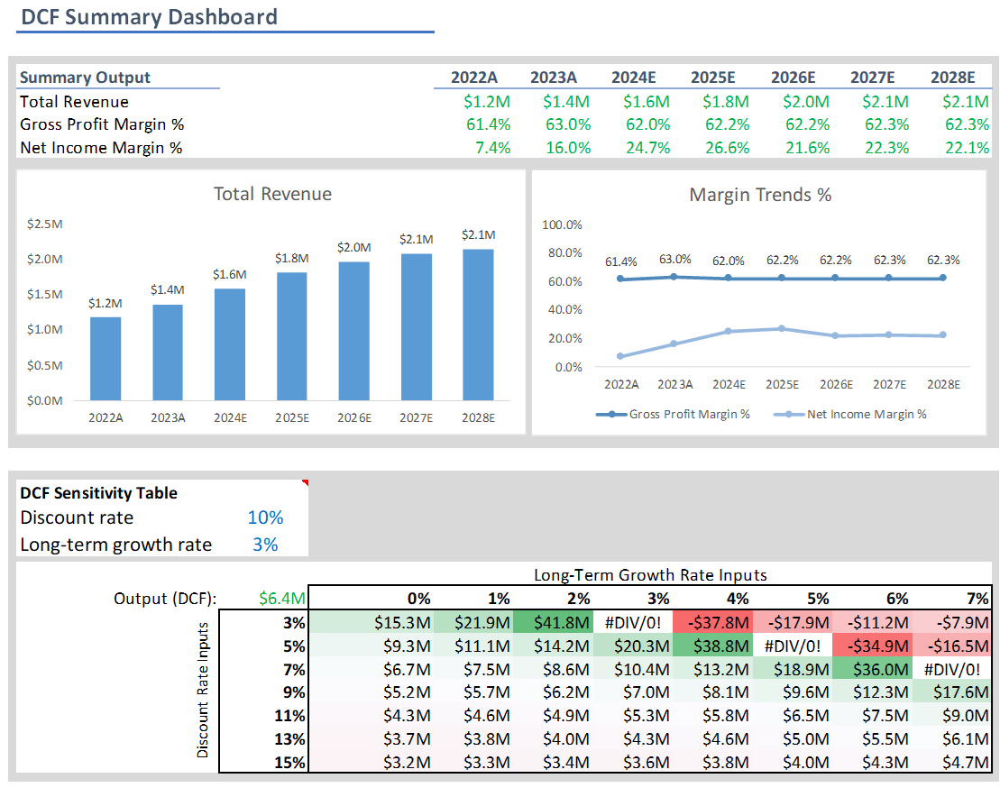

# Financial Modeling and Valuation Analysis 

This Excel based financial model [(download)](https://github.com/AsherGeorgy/My-Portfolio/raw/refs/heads/main/Microsoft%20Excel/assets/3S%20and%20DCF%20Model%20.xlsx) is designed for dynamic three-statement modeling, scenario analysis, discounted cash flow (DCF) valuation and sensitivity analysis. 

## Acknowledgment
This financial model was originally created by [Financial Analyst Network](http://www.youtube.com/@financialanalystnetwork) on YouTube. Their insightful video provided the foundation for this model, and I appreciate their work in making financial modeling more accessible.

## Project Overview
• Comprehensive financial model to analyze company performance and valuation, incorporating the three financial statements: Income Statement, Balance Sheet, and Cash Flow Statement.  

• Discounted Cash Flow (DCF) analysis to estimate the intrinsic value of the company, considering future cash flows, terminal value, and discount rates.  

• Dynamic dashboard to present key findings and allow scenario analysis, illustrating various possible outcomes.

### Features

1. **Dynamic Three-Statement Model:**
   - Forecasts one year for each of the three main financial statements: Income statement, Cash Flow Statement, and Balance Sheet.

2. **Scenario Analysis:**
   - Utilizes an assumptions column on each sheet for adjusting the model for different scenarios.

3. **DCF Valuation:**
   - Five-year Cash Flow projections.
   - Terminal value calculation.
   - Application of WACC to obtain the total present value of the business.

4. **Summary Dashboard:**
   - Display of key forecasted values, including Total Revenue, Gross Profit Margin %, and Net Income Margin % for the years 2022 to 2028.
   - Dynamic charts.
   - WACC Calculation.
   - DCF sensitivity analysis Data Table showing changes in Total Present Value with different WACC and Long Term Growth Rate combinations.

### Documentation

- Each sheet includes a "Documentation" section at the bottom describing assumptions, steps, and formatting decisions.
- Example: Sheet #2 (Operating Expense Forecast) explains formatting conventions, assumptions about expenses, and how to perform dynamic scenario analysis.

## How to Use

1. **Scenario Analysis:**
   - Adjust the 'Assumptions' column formatted in blue for scenario analysis.

2. **Navigation:**
   - Sheets are organized logically for a step-by-step financial modeling process.
   - Follow the documentation at the bottom of each sheet for clarity.

3. **Dashboard Updates:**
   - The Summary Dashboard is dynamic, as it is linked to model outputs.

## Screenshots
**Dashboard:**  
    
